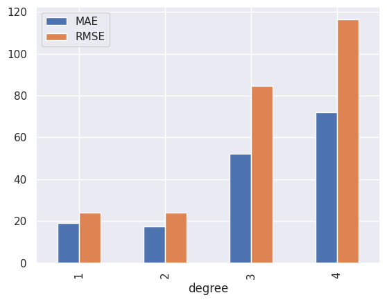
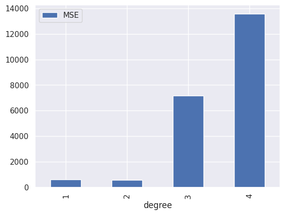
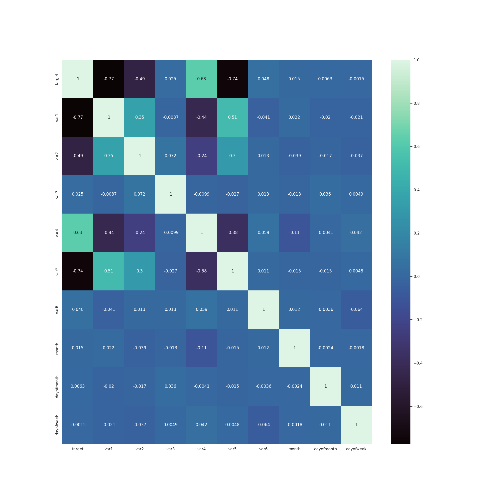
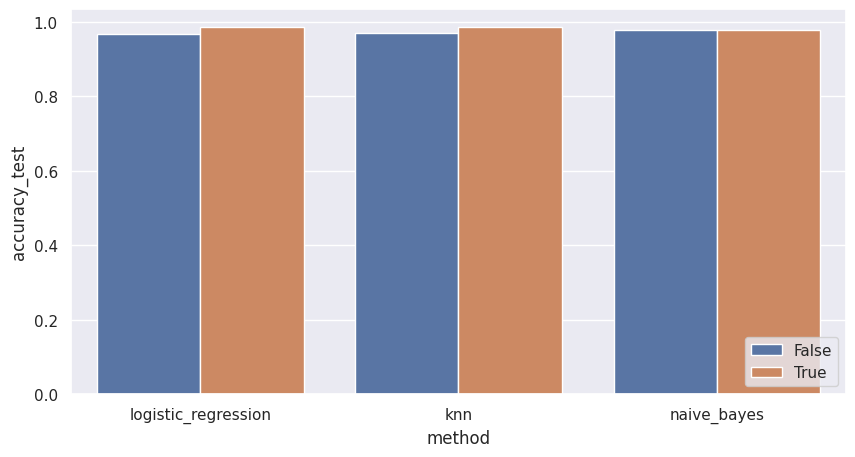

# Lev Kozlov B20-RO1

# l.kozlov@innopolis.university

# Theoretical part

## Preprocessing

1. Which regression model was the most effective for the missing values, and why?

   - for my case it was polynomial with degree 2,
     because it had the lowest errors in range [1, 4]
     
     

1. What encoding technique did you use for encoding the categorical features, and why?

   - I tried one hot encoding and ordinary encoding and decided that ordinary suits me best.
   - I used ordinary encoding for both _var3_ and _var6_.
   - For var3 there are about _236_ unique values and it will make a lot of columns in one hot encoding. It would result in poor performance and difficulties in interpretation.
   - For var6 there are only _2_ unique values, but for my convinience I decided to stick with already used encoding.
   - I used _var7_ in my model, despite it is not categorical, I would like to mention the way I processed it:

     - I converted time series into python object, discovered that it produces errors, as some dates are on 29th of february, the solution was to suppress the errors and substitute them with NaTs.

     ```python
     # transform var7 into time series
     df_raw["var7"] = pd.to_datetime(df_raw["var7"], errors="coerce")

     # remove NaT rows which cannot be processed
     df_raw = df_raw.dropna(subset=["var7"])
     ```

     - The data was splitted into _year_, _month_, _day of week_ and _day of month_. There may be some variations, but it was my choice.
     - I discovered that _year_ in time series does not change, so it was dropped.

## Training

Training results:

| accuracy | accuracy_test | with_pca | method              |
| -------- | ------------- | -------- | ------------------- |
| 0.956553 | 0.967391      | False    | logistic_regression |
| 0.965848 | 0.971014      | False    | knn                 |
| 0.972079 | 0.978261      | False    | naive_bayes         |
| 0.979830 | 0.985507      | True     | logistic_regression |
| 0.976730 | 0.985507      | True     | knn                 |
| 0.973629 | 0.978261      | True     | naive_bayes         |

1. Which classification model performed best, and why?

   - in this question we will consider only results without using PCA, in this case Naive Bayes performed the best. I suppose it is because dataset was not very big. Also if features are more or less independent, Naive Bayes will perform better than other models. It might be the case here.

1. What were the most the most critical features with regard to classification, and why?

   - In order to find such features, I computed the Spearman correlation coefficient. The results are shown below:

   

   We can see that the most critical features are _var1_, _var5_. The reason is that they have the largest absolute value of the correlation coefficient.

1. What features might be redundant or are not useful, and why?

   - From Spearman table we can see that _var3_, _var6_ and those derived from _var7_ (_month_, _dayofmonth_, _dayofweek_) are not useful, because they have the smallest absolute value of the correlation coefficient.

1. Did dimensionality reduction by the PCA improve the model performance, and why?
   - Yes, it did. The reason is that I used PCA with _n_components = 2_, which is equal to amount of more or less significant features.
     
     Despite the fact that difference is not so big, it is still there.

## Additional research

1. What is a multi-label learning problem?

   - [wikipedia source](<https://en.wikipedia.org/wiki/Multi-label_classification#:~:text=Formally%2C%20multi%2Dlabel%20classification%20is,element%20(label)%20in%20y.>)
   - As wikipedia says, multi-label learning is a problem of predicting a set of labels for each instance. It is a generalization of the binary classification problem, where each instance can belong to more than one class.

2. Suggest an example in which you can transform the giben problem into a multi-label problem?

   - First of all we have to add at least one new label which can be applied to each row.
   - Then we might create a binary classifier for each label, which is power set of the available labels. The result will be a multi-label problem.

3. Will the models work as it is in that case, or would some changes be required?
   - I am not sure, because did not have experience with multi-label learning. But I think that our model will work only on one label. In order to make it work with multiple labels, we have to train and use them differently.
